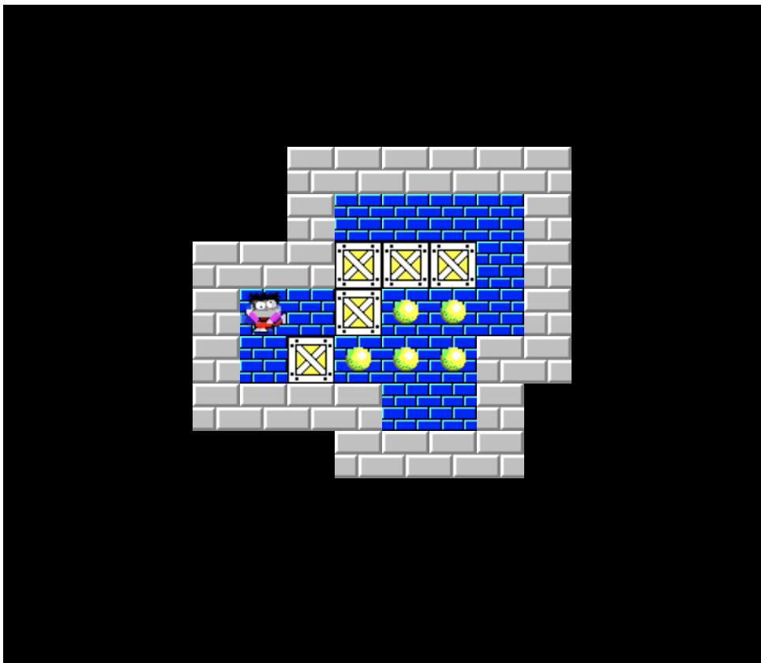
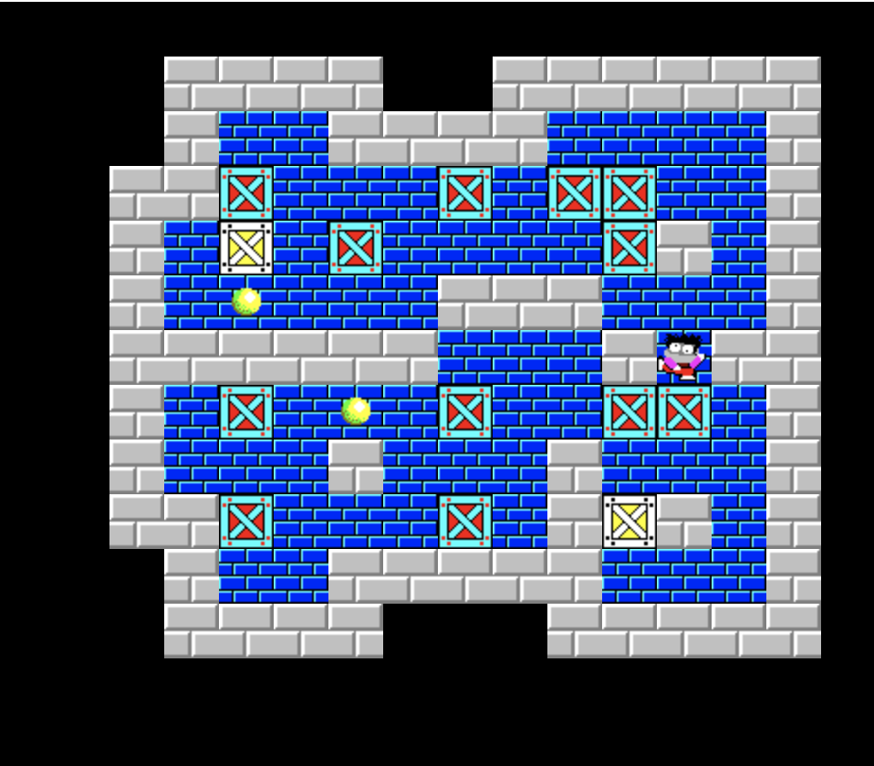

# PUSH BOX

This is a React version of the push box game.
The intention of this game is to demonstrate mainstream react technology and devops.

---

| Author | Jimmy                  |
| ------ | ---------------------- |
| E-mail | chengnianhua@gmail.com |

---

## Table Content

- [How to Play](#how-to-play)
- [How to Install](#how-to-install)
- [Design Highlight](#design-highlight)
- [Other Implementations](#other-implementations)

## How To Play

The game is simple, use key "up", "left", "right", "down" to move the little man around. Use key "u" to undo a step. e.g. for the task 10, it is displayed:



The target is to make sure all the balls are covered by the box.

click the menu "Game" and select "Jump to Task", input the task ID from 1 to 100, e.g. input 33
then the task 88 is displayed:



## How To Install

Clone the git respository use `git clone` and import the project in eclipse or intelij.

## Design Highlight

The game is controlled by a matrix:

```Javascript
grid = new Cell[14][16];  //14 rows and 16 columns.
```

Each cell is an object with current status:

```Java
public class Cell {
    boolean black;
    boolean wall;
    boolean floor;
    boolean box;
    boolean ball;
    boolean spirit;
    int action;

    public Cell() {
        black = false;
        wall = false;
        floor = false;
        box = false;
        ball = false;
        spirit = false;
        action = NONE;
    }
}
```

In terms of the MVC design pattern, there the `grid` is the Model, the `canvas` is the view, the `keyUp/Down` event is the controller.

## References

1. https://github.com/TarikHuber/react-most-wanted

## Other Implementations

#### Delphi Version

#### React Version
